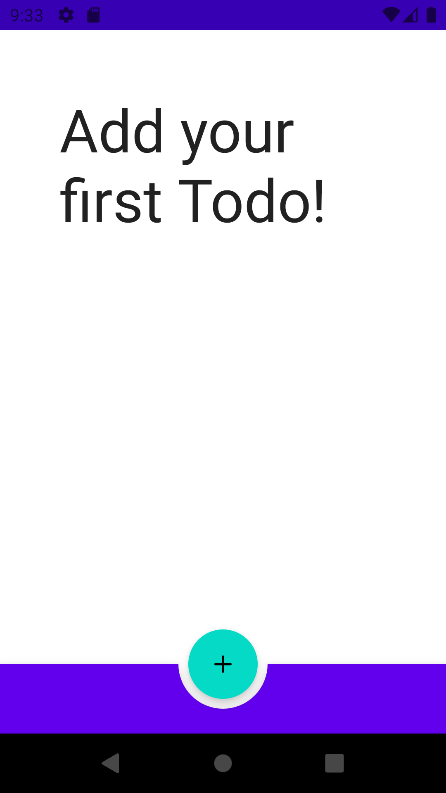
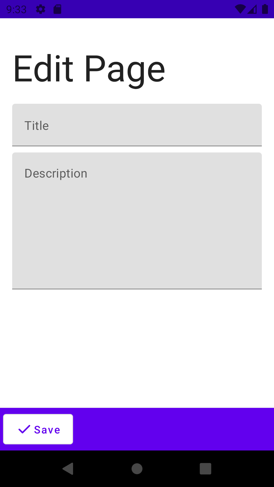
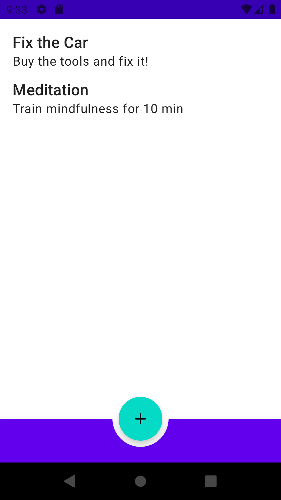

# TODO App Sample
A very simple TODO app demonstrating the use of Komposable Architecture featuring:

- Three reducers - [ListReducer](src/main/java/com/toggl/komposable/sample/todo/list/ListReducer.kt), [EditReducer](src/main/java/com/toggl/komposable/sample/todo/edit/EditReducer.kt), [NavigationReducer](src/main/java/com/toggl/komposable/sample/todo/NavigationReducer.kt)
- One effect - [SaveTodoEffect](src/main/java/com/toggl/komposable/sample/todo/edit/EditReducer.kt#L32)
- One subscription - [ListSubscription](src/main/java/com/toggl/komposable/sample/todo/list/ListSubscription.kt)
- Reducer tests - [TestListReducer](src/test/java/com/toggl/komposable/sample/todo/TestListReducer.kt)

We aim to demonstrate how Komposable Architecture fits in a real environment. Thus we are using real DI (Hilt) and an actual database (Room) instead of mocked alternatives. The UI is created using Jetpack Compose, and Stores are managed by Jetpack viewModels. 

## Android Studio IDE requirements

You require the latest stable [Android Studio Arctic Fox](https://developer.android.com/studio/#downloads) release to be able to build the app. This is because the project is written in [Jetpack Compose](https://developer.android.com/jetpack/compose).